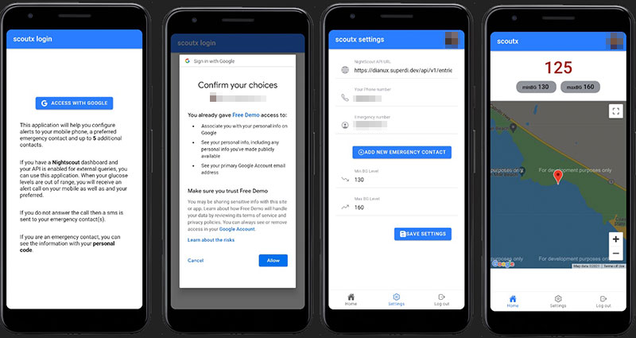

# ScoutX Mobile 
> More documentation on how to compile your own APK and set up your Vonage or Twilio Account is coming soon!
---
- [Goal](#goal)
- [Backend](#backend)
- [The application](#the-application)


## Goal

The goal of this project is to migrate the current implementation of [ScoutX](https://github.com/alphacentauri82/scoutx) to
an Ionic-Angular solution. With Scoutx running on a mobile device, the system can access to the device's GPS location and in case of emergency, all emergency contacts will receive precise location through a text message.

## Backend

The backend remains like the original python implementation, the web part was completely removed and the `notifier.py` has changes in the `sms_glucose_alert` function. If location is detected, the SMS will contain a Google Maps Link with the following format ` https://www.google.com/maps/@{0},{1},18.4z`.


To deploy, follow the instructions in the original [Scoutx Repository](https://github.com/alphacentauri82/scoutx). There's also a dockerfile should you want to deploy the backend to cloudrun.

## The Application


### Dependencies
+ [Google Sign-In Cordova/PhoneGap Plugin](https://github.com/EddyVerbruggen/cordova-plugin-googleplus)
+ [Cordova Background Geolocation](https://github.com/transistorsoft/cordova-background-geolocation-lt)

### Considerations Before Building


#### 1.- debug.keystore

In order to build and set the Firebase Authentication for the Android version, a `keystore` file is required to get the SHA Certificate Fingerprint that will match with the Auth Provider.

An easy way to create it in a Unix based OS is exceuting the following command: 

```bash

keytool -genkey -v -keystore debug.keystore -alias androiddebugkey -keyalg RSA -keysize 2048 -validity 50000

```

After that to get the fingerprint, execute the following command:

```bash
keytool -exportcert -alias androiddebugkey -keystore debug.keystore -list -v
```

For more information and specifics abbout these commands check the official documentation from Google: [Authenticating Your Client
](https://developers.google.com/android/guides/client-auth)

After creating the `keystore` file, the path name, password and alias need to be specified in the **build.json** file included in the project.


#### 2.- google-services.json

The `google-services.json` file generated by Firebase needs to be included in the mobile directory.

### Build

If all the required files are in place, build the application by executing:

```
npm run build
```




### Errors

If Android studio fails compiling or the Firebase Authentication is "stuck", just check that the version used by play-services libraries are the same in the `project.properties` file. I.E. : 16.+

```
cordova.system.library.1=com.google.android.gms:play-services-location:16.+
cordova.system.library.8=com.google.android.gms:play-services-auth:16.+
cordova.system.library.9=com.google.android.gms:play-services-identity:16.+
```

## Giving Thanks

Thanks to [@josueggh](https://github.com/josueggh) for his continued support and contributions to this project 💜 

## Contributing

All contributions are welcome. Make sure you follow the [code of conduct](CODE_OF_CONDUCT.MD) in this repository. 
